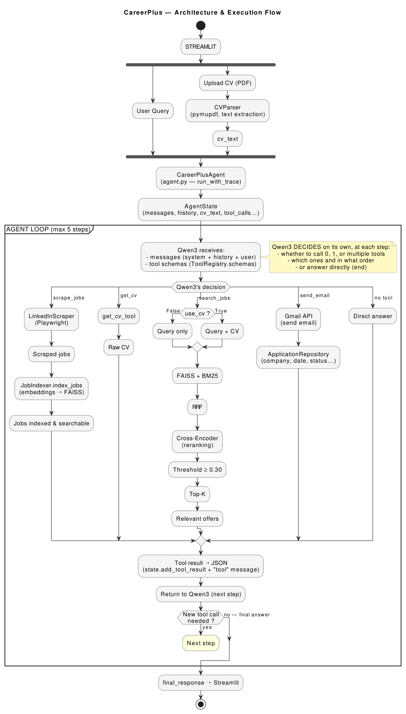

# CareerPulse

CareerPulse is an AI-powered career assistant designed to help users discover, search, and manage job opportunities.

The platform combines LinkedIn job scraping, hybrid Retrieval-Augmented Generation (RAG), CV–job matching, and an AI agent capable of routing user requests to the appropriate workflow.

## Features

- 🔎 LinkedIn job scraping
- 🧠 Hybrid job search using semantic and lexical retrieval
- 🤖 AI agent with tool calling
- 📄 CV upload and parsing
- 🎯 CV–job matching
- 📧 Automated email sending through the Gmail API
- 📝 Automatic application tracking
- 🔄 Application status management
- 💬 AI assistant for questions about scraped job offers
- 💻 Local LLM inference using Ollama

## Architecture

The overall CareerPulse architecture is illustrated below:

<p align="center">
  
</p>

The system is organized around several components.

### Job Scraping

A LinkedIn scraping tool collects job offers based on:

- Job title
- Keywords
- Company filters

Scraped offers are automatically indexed for later retrieval.

### CV Processing

Users can upload their CV directly through the Streamlit chat interface.

The CV is processed using PyMuPDF to extract its textual content. The extracted CV text is then made available to the AI agent.

The agent can use the CV in two ways:

- `get_cv` → answer general questions about the uploaded CV
- `search_jobs` with `use_cv=True` → perform CV–job matching

This allows users to ask questions about their CV without necessarily triggering the job-matching workflow.

### Hybrid RAG

CareerPulse combines:

- Dense semantic retrieval using BGE-M3 embeddings
- Lexical retrieval using BM25
- FAISS vector search
- Reciprocal Rank Fusion (RRF)
- Cross-encoder reranking
- Reranker threshold filtering

For normal job searches, the system searches using the user's query.

For CV–job matching, the system combines the user's query with the extracted CV content before performing hybrid retrieval and reranking.

### AI Agent

The AI agent uses Qwen3 with tool calling to select the appropriate workflow:

- `scrape_jobs` → discover new LinkedIn job offers
- `get_cv` → answer questions about the uploaded CV
- `search_jobs` → search indexed job offers, optionally using the CV for matching
- `send_email` → send an application email

The agent decides which tool should be executed based on the user's request and the available context.

### Automated Applications

When an application email is successfully sent, CareerPulse records the application with:

- Company
- Recipient email
- Date of application
- Application type (spontaneous or job-specific)
- Application status

Application data is stored locally.

## Technologies

- Python
- FastAPI
- Streamlit
- Ollama
- Qwen3
- Sentence Transformers
- BGE-M3
- FAISS
- BM25
- Cross-Encoder
- PyMuPDF
- Gmail API
- Playwright

## API

The backend exposes REST endpoints through FastAPI.

Main endpoints:

```text
GET  /api/v1/health
POST /api/v1/chat
POST /api/v1/search-jobs
POST /api/v1/send-email
```
